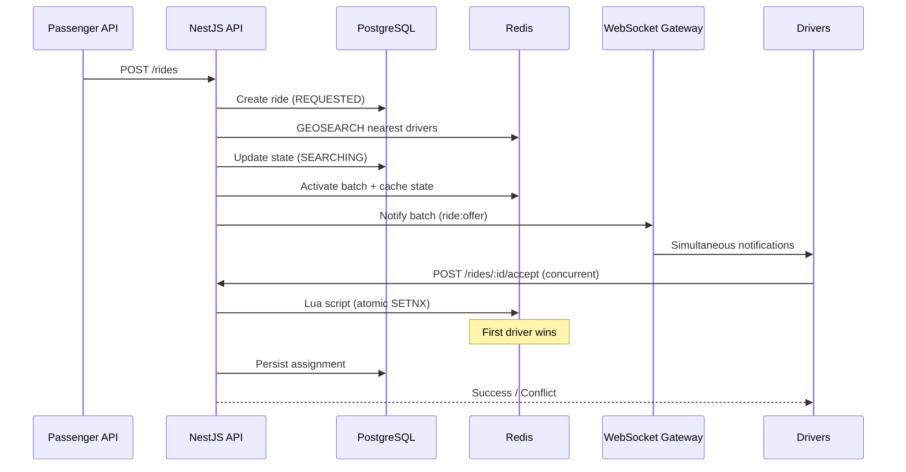

# Real-Time Driver Allocation System

Production-ready ride hailing backend built with **NestJS**, **PostgreSQL**, **Redis**, **Docker**, and **TypeScript**. Implements real-time driver discovery via Redis GEO, WebSocket notifications, atomic ride assignment with Redis Lua, idempotent acceptance, and batch timeout/retry logic.

## Architecture



### Ride request flow

```
Ride Request → Redis GEO Search → Driver Notification → Driver Acceptance → Redis Lua Lock → Assignment → Ride Updated
```

## Tech stack

| Layer | Technology |
|-------|------------|
| Framework | NestJS 11 |
| Database | PostgreSQL 16 + TypeORM |
| Cache / GEO / Locks | Redis 7 (GEOADD, GEOSEARCH, Lua) |
| Real-time | Socket.IO WebSocket Gateway |
| Runtime | Node.js 20, TypeScript |
| Testing | Jest + Supertest |
| Containers | Docker & Docker Compose |

## Project structure

```
src/
├── common/          # Enums, filters, interceptors
├── database/        # TypeORM entities & module
├── driver/          # Driver registration, location, status
├── ride/            # Ride lifecycle, search batches, acceptance
├── redis/           # Redis client, GEO ops, Lua script
├── websocket/       # Driver notification gateway
└── tests/           # Concurrency integration tests
```

## Quick start (Docker)

```bash
# Start all services (API, PostgreSQL, Redis)
docker compose up --build

# API available at http://localhost:3000
```

## Local development

### Prerequisites

- Node.js 20+
- PostgreSQL 16+
- Redis 7+

### Setup

```bash
cp .env.example .env
npm install

# Start dependencies
docker compose up -d postgres redis

# Run API
npm run start:dev
```

## Environment variables

| Variable | Default | Description |
|----------|---------|-------------|
| `PORT` | `3000` | HTTP port |
| `DB_HOST` | `localhost` | PostgreSQL host |
| `DB_PORT` | `5432` | PostgreSQL port |
| `DB_USERNAME` | `postgres` | Database user |
| `DB_PASSWORD` | `postgres` | Database password |
| `DB_DATABASE` | `ride_hailing` | Database name |
| `REDIS_HOST` | `localhost` | Redis host |
| `REDIS_PORT` | `6379` | Redis port |
| `RIDE_SEARCH_RADIUS_KM` | `50` | Driver search radius |
| `RIDE_SEARCH_BATCH_SIZE` | `5` | Drivers notified per batch |
| `RIDE_SEARCH_TIMEOUT_MS` | `30000` | Batch acceptance window |

## API documentation

### Driver APIs

#### Register driver

`POST /drivers`

```bash
curl -X POST http://localhost:3000/drivers \
  -H "Content-Type: application/json" \
  -d '{"name":"Alice Driver","phone":"+15550001111"}'
```

#### Update location

`PATCH /drivers/:id/location`

Stores coordinates in PostgreSQL and Redis GEO (`drivers:geo`).

```bash
curl -X PATCH http://localhost:3000/drivers/{driverId}/location \
  -H "Content-Type: application/json" \
  -d '{"latitude":12.9716,"longitude":77.5946}'
```

#### Update status

`PATCH /drivers/:id/status`

Values: `ONLINE` | `OFFLINE`. Online drivers are indexed in Redis GEO and `drivers:online` set.

```bash
curl -X PATCH http://localhost:3000/drivers/{driverId}/status \
  -H "Content-Type: application/json" \
  -d '{"status":"ONLINE"}'
```

### Ride APIs

#### Request ride

`POST /rides`

Flow:
1. Creates ride in PostgreSQL (`REQUESTED`)
2. Finds nearest 5 online drivers via Redis `GEOSEARCH`
3. Sets state to `SEARCHING`
4. Notifies drivers via WebSocket (`ride:offer` event)
5. Starts 30s batch timeout for retry/timeout handling

```bash
curl -X POST http://localhost:3000/rides \
  -H "Content-Type: application/json" \
  -d '{
    "passengerId": "passenger-001",
    "pickupLatitude": 12.9716,
    "pickupLongitude": 77.5946,
    "destinationLatitude": 12.9352,
    "destinationLongitude": 77.6245
  }'
```

#### Accept ride

`POST /rides/:rideId/accept`

Headers:
- `Idempotency-Key` (optional but recommended)

Body:
```json
{ "driverId": "uuid" }
```

Concurrency guarantees:
- Redis Lua script performs atomic assignment (`SETNX` on assignment key)
- Only one driver wins under concurrent load
- Same driver + same idempotency key returns the original success response
- Late acceptance after batch expiry returns `410 Gone`

```bash
curl -X POST http://localhost:3000/rides/{rideId}/accept \
  -H "Content-Type: application/json" \
  -H "Idempotency-Key: accept-attempt-1" \
  -d '{"driverId":"{driverId}"}'
```

#### Get ride

`GET /rides/:rideId`

```bash
curl http://localhost:3000/rides/{rideId}
```

### Ride states

| State | Description |
|-------|-------------|
| `REQUESTED` | Ride created |
| `SEARCHING` | Drivers being notified |
| `ASSIGNED` | Driver claimed ride |
| `TIMEOUT` | No driver accepted in time |
| `COMPLETED` | Ride finished |
| `CANCELLED` | Ride cancelled |

## WebSocket

Namespace: `/drivers`

Connect with driver ID query param:

```javascript
const socket = io('http://localhost:3000/drivers', {
  query: { driverId: 'YOUR_DRIVER_UUID' }
});

socket.on('ride:offer', (payload) => {
  console.log('New ride offer:', payload);
});
```

Event: `ride:offer`

Payload:
```json
{
  "rideId": "uuid",
  "pickupLatitude": 12.9716,
  "pickupLongitude": 77.5946,
  "batchIndex": 0,
  "expiresAt": "2026-06-24T12:00:30.000Z"
}
```

## Redis usage

| Key pattern | Purpose |
|-------------|---------|
| `drivers:geo` | Driver locations (GEOADD / GEOSEARCH) |
| `drivers:online` | Set of online driver IDs |
| `ride:{id}:state` | Cached ride state |
| `ride:{id}:assignment` | Atomic assignment record |
| `ride:{id}:batch:active` | Active batch token (TTL = 30s) |
| `ride:{id}:notified` | Drivers already notified |
| `idempotency:{key}` | Idempotent accept responses |

## Concurrency design

1. **Acceptance serialized in Redis Lua** — check state, batch expiry, existing assignment, and claim in one atomic script.
2. **`SETNX` assignment key** — first concurrent writer wins; others receive `LOST_RACE` or `ALREADY_CLAIMED`.
3. **Idempotency keys** — stored with TTL; duplicate retries replay stored JSON response.
4. **Batch expiry inside Lua** — late accepts fail even if HTTP arrives after timeout.
5. **PostgreSQL unique constraint** on `ride_assignments.ride_id` — defense in depth against duplicate rows.
6. **Persist after Redis win** — DB is updated only after Redis confirms assignment.

## Testing

```bash
# Unit tests
npm test

# Concurrency test (requires PostgreSQL + Redis)
docker compose up -d postgres redis
npm run test:concurrency
```

The concurrency test:
1. Creates 20 online drivers
2. Creates a ride
3. Fires 20 simultaneous accept requests via `Promise.all()`
4. Asserts exactly one success and 19 failures
5. Verifies a single assignment row

## Postman

Import `postman/Ride-Hailing-API.postman_collection.json`.

Set collection variables:
- `baseUrl` → `http://localhost:3000`
- `driverId` → driver UUID from register response
- `rideId` → ride UUID from request response

## Scripts

| Command | Description |
|---------|-------------|
| `npm run start:dev` | Development server with hot reload |
| `npm run build` | Compile TypeScript |
| `npm run start:prod` | Run compiled app |
| `npm test` | Unit tests |
| `npm run test:concurrency` | Concurrent acceptance integration test |
| `npm run test:e2e` | End-to-end tests |

## License

UNLICENSED — technical assignment project.
